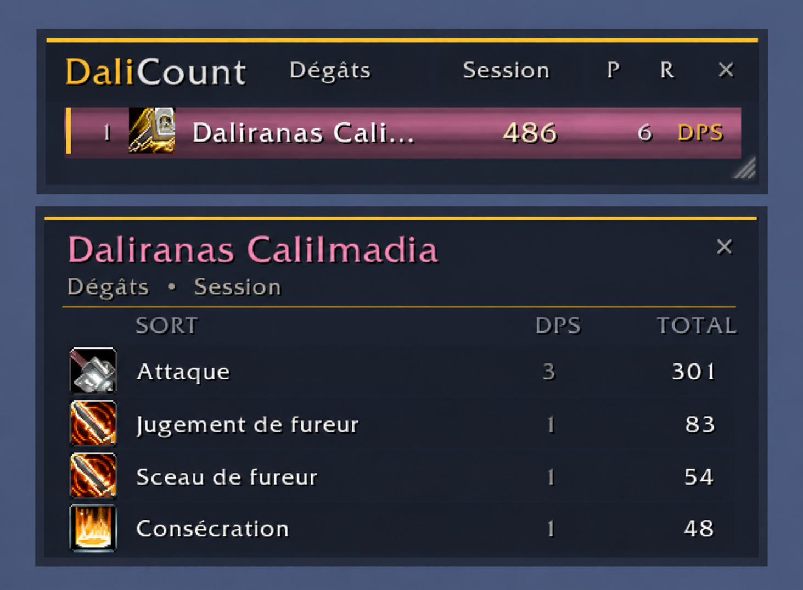
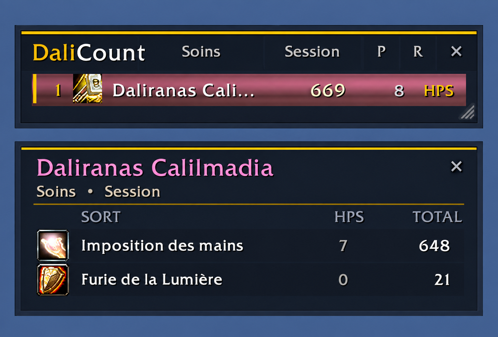

<p align="center">
  
</p>

<h1 align="center">DaliCount</h1>

<p align="center">
  <strong>Un compteur de combat léger, compact et moderne pour plusieurs versions de World of Warcraft.</strong>
</p>

<p align="center">
  
  
  
  
</p>

DaliCount affiche les dégâts, les soins et les principales statistiques de combat dans une interface redimensionnable et semi-transparente. Il s'appuie exclusivement sur l'API native `C_DamageMeter` et ne nécessite aucun framework externe.

Version actuelle : **0.9.1**.

> Vous consultez la branche **Forever**, dédiée au client WoW Forever.

## Branches prises en charge

Chaque famille du jeu possède sa propre branche afin que les fichiers TOC, les correctifs et les publications restent indépendants.

| Branche | Destination | Rôle |
|---|---|---|
| [`main`](https://github.com/daliranas/DaliCount/tree/main) | Base stable | Documentation commune et dernière base validée |
| [`forever`](https://github.com/daliranas/DaliCount/tree/forever) | WoW Forever | Développement et publications pour Forever |
| [`retail`](https://github.com/daliranas/DaliCount/tree/retail) | WoW Retail | Développement et publications pour Retail |

Convention des tags : `forever-vX.Y.Z` et `retail-vX.Y.Z`. Les suffixes `-alpha` et `-beta` déterminent automatiquement le type de fichier sur CurseForge.

## Aperçu

<p align="center">
  
  
</p>

## Points forts

- Dégâts, DPS, soins, HPS et absorptions.
- Dégâts subis et évitables.
- Interruptions, dissipations et morts.
- Combat actuel ou session globale.
- Détail par sort disponible hors combat.
- Barres aux couleurs de classe et icônes de spécialisation.
- Hauteur automatique selon le nombre de participants.
- Largeur, échelle et transparence configurables.
- Fenêtre déplaçable et verrouillable.
- Partage du classement vers Groupe, Dire ou Raid.
- Aucune dépendance : ni Ace3, ni LibStub.

## Installation

1. Téléchargez ou clonez ce dépôt.
2. Fermez World of Warcraft.
3. Copiez le dossier `DaliCount` dans le dossier correspondant à votre client :

   ```text
   World of Warcraft/_classic_beta_/Interface/AddOns/  # Forever
   World of Warcraft/_retail_/Interface/AddOns/        # Retail
   ```

4. Vérifiez que le fichier suivant existe :

   ```text
   .../Interface/AddOns/DaliCount/DaliCount.toc
   ```

5. Relancez WoW et activez **DaliCount** dans la liste des addons.

Utilisez `/dc` pour afficher ou masquer la fenêtre.

## Utilisation

| Action | Résultat |
|---|---|
| Clic gauche sur la statistique | Mode suivant |
| Clic droit sur la statistique | Mode précédent |
| Clic sur `Combat` ou `Session` | Change la période affichée |
| Clic sur une ligne | Ouvre le détail par sort hors combat |
| Bouton `P` | Ouvre le menu de partage |
| Bouton `R` | Réinitialise les données de combat |
| Poignée inférieure droite | Modifie la largeur |

## Commandes

### Affichage

| Commande | Description |
|---|---|
| `/dc` | Afficher ou masquer DaliCount |
| `/dc show` | Afficher la fenêtre |
| `/dc hide` | Masquer la fenêtre |
| `/dc lock` | Verrouiller la fenêtre |
| `/dc unlock` | Déverrouiller la fenêtre |
| `/dc position` | Réinitialiser la position, la largeur et l'échelle |

### Apparence

| Commande | Description |
|---|---|
| `/dc rows 1-15` | Définir le nombre maximal de lignes |
| `/dc auto on` | Adapter automatiquement la hauteur |
| `/dc auto off` | Conserver un nombre fixe de lignes |
| `/dc scale 75-150` | Modifier l'échelle en pourcentage |
| `/dc opacity 10-100` | Modifier l'opacité du fond |

### Données

| Commande | Description |
|---|---|
| `/dc combat` | Afficher le combat actuel |
| `/dc session` | Afficher la session globale |
| `/dc reset` | Effacer les sessions de combat |
| `/dc mode` | Passer au mode suivant |
| `/dc mode <nom>` | Sélectionner directement un mode |

Modes disponibles :

```text
damage, dps, healing, hps, absorbs,
interrupts, dispels, taken, avoidable, deaths
```

### Partage

```text
/dc report groupe 5
/dc report dire 5
/dc report raid 5
```

Le nombre final sélectionne entre 1 et 10 entrées. Le canal **Dire** est protégé par WoW : DaliCount prépare le rapport dans la zone de discussion, puis vous confirmez son envoi avec `Entrée`. Groupe et Raid sont envoyés automatiquement hors combat.

## Compatibilité des clients

Les adaptations propres à chaque client sont isolées dans les branches `forever` et `retail`. Pendant le combat, certaines informations fournies par `C_DamageMeter` sont des **secret values** protégées par le client.

DaliCount respecte ces restrictions :

- aucun tri ou calcul Lua sur les valeurs protégées ;
- conservation de l'ordre fourni par Blizzard ;
- transmission directe des valeurs aux widgets natifs autorisés ;
- détail des sorts et partage accessibles hors combat ;
- aucune reconstruction via `COMBAT_LOG_EVENT_UNFILTERED`.

## Dépannage

Pour afficher les erreurs Lua :

```text
/console scriptErrors 1
/reload
```

Si la position ou les réglages sont perdus après un redémarrage complet, cela peut provenir du chargement des `SavedVariables` sur certaines versions bêta de WoW Forever.

## Publication automatique sur CurseForge

Le dépôt contient un fichier [`.pkgmeta`](.pkgmeta) compatible avec le packager automatique de CurseForge. Il crée une archive nommée `DaliCount`, exclut les ressources réservées à GitHub et utilise [`CHANGELOG.md`](CHANGELOG.md) comme notes de version.

La connexion du dépôt doit être effectuée une seule fois dans **GitHub → Settings → Webhooks → Add webhook** :

```text
https://www.curseforge.com/api/projects/PROJECT_ID/package?token=CURSEFORGE_TOKEN
```

Remplacez `PROJECT_ID` par l'identifiant numérique du projet CurseForge et `CURSEFORGE_TOKEN` par un jeton créé sur la page des API tokens. Le jeton est un secret : il ne doit jamais être ajouté aux fichiers du dépôt.

Ensuite, publiez une version avec un tag Git :

```bash
git tag forever-v0.9.1
git push origin forever-v0.9.1
```

Un tag contenant `beta` produit un fichier bêta sur CurseForge, `alpha` produit un fichier alpha et un tag ne contenant aucun de ces mots produit une version stable.

## Auteur

Développé par **Daliranas**.
